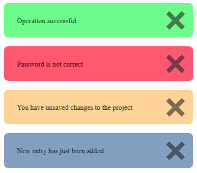
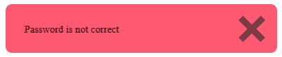
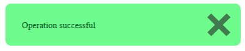

# Alerts
Alerts for use on websites. Written in JavaScript

<br>

## SRC
```diff
- REMEMBER TO PUT THE SCRIPT LINE IN `<body></body>`

<script src="https://webtochange.github.io/alert/alert.js"></script>
```
(maybe this will change in the future, but for now the script must be in the body)

<details>
<summary><h1>HOW TO USE</h1></summary>

### `Alert(MSG, TYPE, REMOVE TIME, REDIRECT TO);`

<hr>
<details>
<summary><h2>MSG:</h2></summary>

*`string` message to show in alert*

</details>

<details>
<summary><h2>TYPE:</h2></summary>

**default = `0`**

*type of alert:*

- `0` = success
- `1` = error
- `2` = warning
- `3` = info

<details>
<summary><h3>EXAMPLE</h3></summary>

<br>
Code:
<pre>
Alert("Operation successful", 0);
Alert("Password is not correct", 1);
Alert("You have unsaved changes to the project", 2);
Alert("New entry has just been added", 3);
</pre>
Resoult:


<br>
</details>

</details>

<details>
<summary><h2>REMOVE TIME:</h2></summary>

**default = 0**

*time after which the alert disappears*

`0` = never disappears

*time in `ms` (the script itself will add an additional 5s for the animation)*

</details>

<details>
<summary><h2>REDIRECT TO:</h2></summary>

**default = ""**

*the location where alert will redirect you when you close it (if it closes itself, it will redirect you)*

<br>
(the script in this version is currently executing: window.location.href = REDIRECT TO)

In the future, there will be an option for the alert to be displayed on the page to which the alert redirects you

</details>

</details>

<details>
<summary><h1>EXAMPLES</h1></summary>

## Types:

Code:
<pre>
Alert("Operation successful", 0);
Alert("Password is not correct", 1);
Alert("You have unsaved changes to the project", 2);
Alert("New entry has just been added", 3);
</pre>
Resoult:


<hr>
<br>

## Time to remove

Code:
<pre>
Alert("Password is not correct", 1, 10000);
</pre>
Resoult:

*the alert will disappear after `10 seconds [1000ms]` (including animations after 15 seconds)*



<hr>
<br>

## Redirect to

Code:
<pre>
Alert("Operation successful", 0, 0, "index.html");
</pre>
Resoult:

*the alert will redirect to `index.html` when you closed it*




</details>
